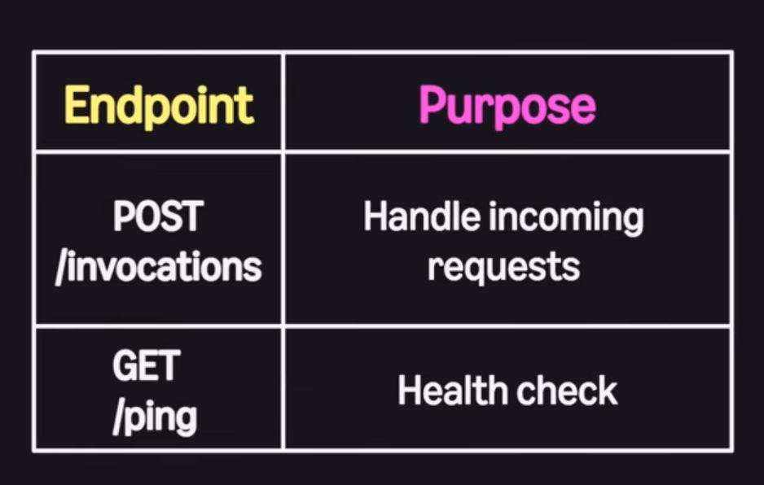

## Setup bedrock 
- /setup-bedrock
- status

  ```
  {
      "env": {
      "CLAUDE_CODE_USE_BEDROCK": "1",
      "AWS_REGION": "us-east-1",
      "AWS_PROFILE": "aws-profile"
    },
    "theme": "dark"
  }
  ```

  use mantal 
  ```
    {
        "env": {
        "CLAUDE_CODE_USE_MANTLE": "1",
        "AWS_REGION": "us-east-1",
        "AWS_PROFILE": "cd-devlite-bedrock"
      },
      "model": "anthropic.claude-opus-4-8",
      "theme": "dark"
    } 

  ```

  ## AWS bedrock Mantle

 - Zero Operator Access - 
 - Advanced scheduling 
 
 ## Deploying on Agentcore 
 - from bedrock_agentcore import BedrockAgentCoreApp
 -  app = BedrockAgentCoreApp()
 - @app.entrypoint

 

 install starter toolkit 
 - `pip install bedrock-agentcore-starter-toolkit`
 - `agetncore create` - start fresh project - TRY THIS
 - `agentcore configure`
